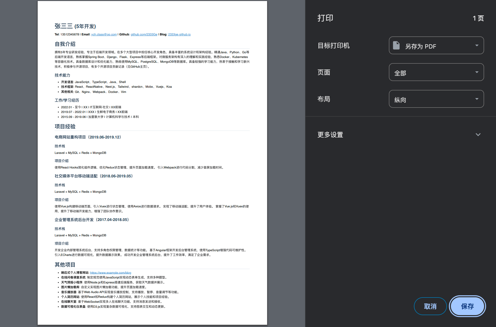

# MD简历模板

## 介绍

使用marked.js渲染markdown，预定义了样式，简历默认打印效果如下




## 使用

```bash
npm instal -g http-server
# 当前目录执行
http-server -p 8080
```

打开 `http://localhost:8080/resume.html`

然后就可以修改自己的简历了，只需要修改`resume.md`即可

## Thanks 

- https://github.com/imdong/resume.md
- https://github.com/imdong/imdong.github.io