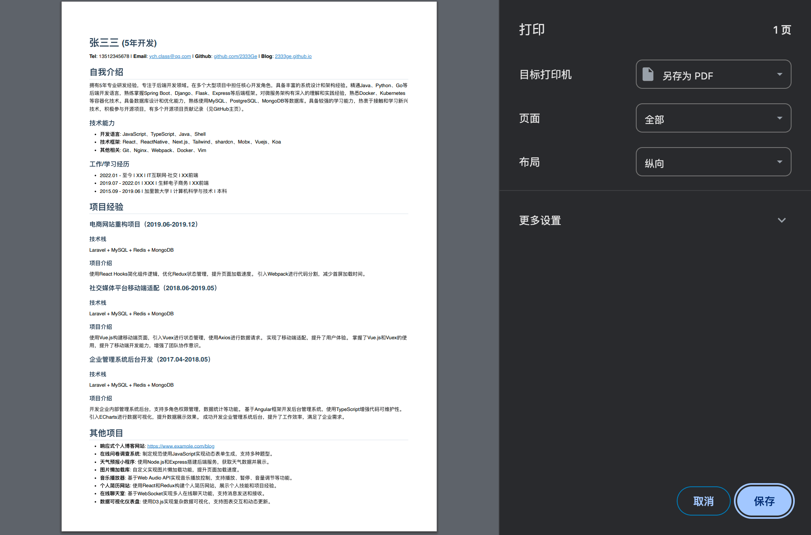

# MD简历模板

## 介绍

使用marked.js渲染markdown，预定义了样式，简历默认打印效果如下




## 使用

```bash
npm install
npm start
```

浏览器会自动打开 `http://localhost:8080/resume.html`

修改 `resume.md` 保存后，浏览器会自动刷新，实时预览简历效果

## Thanks 

- https://github.com/imdong/resume.md
- https://github.com/imdong/imdong.github.io